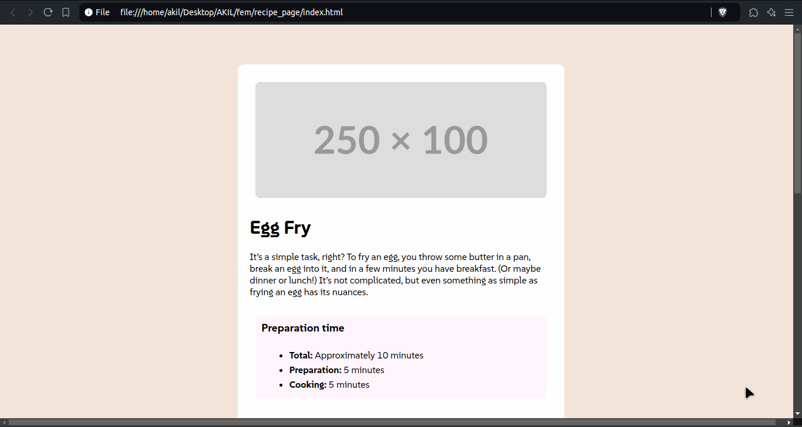

# Frontend Mentor - Recipe page solution

This is a solution to the [Recipe page challenge on Frontend Mentor](https://www.frontendmentor.io/challenges/recipe-page-KiTsR8QQKm). Frontend Mentor challenges help you improve your coding skills by building realistic projects. 

## Table of contents

- [Overview](#overview)
  - [The challenge](#the-challenge)
  - [Screenshot](#screenshot)
  - [Links](#links)
- [My process](#my-process)
  - [Built with](#built-with)
  - [What I learned](#what-i-learned)
  - [Useful resources](#useful-resources)
- [Author](#author)

## Overview

### Screenshot



### Links

- Solution URL: [https://github.com/akil4/recipe_page](https://github.com/akil4/recipe_page)
- Live Site URL: [https://akil4.github.io/recipe_page/](hhttps://akil4.github.io/recipe_page/)

## My process

### Built with

- Semantic HTML5 markup
- CSS custom properties
- Flexbox
- Table
- Mobile-workflow

### What I learned

I learned to make a mobile workflow with the help of media queries. 

```css
@media screen and (max-width: 768px) {
    .container {
        width: 100vw;
    }

    body {
        padding: 0;
    }
}
```

### Useful resources

- [Google Fonts](https://fonts.google.com/) - Provides fonts to implement in your webpage.
- [PlaceholdCo](https://placehold.co/) - Provides placeholder images of any size.
- [ColorPick EyeDropper] - Helped me pick colors.
- [SimplyRecipes](https://www.simplyrecipes.com/) - Made my recipe with the help of this site.

## Author

- GitHub - [akil4](https://github.com/akil4/)
- Frontend Mentor - [@akil4](https://www.frontendmentor.io/profile/akil4)
